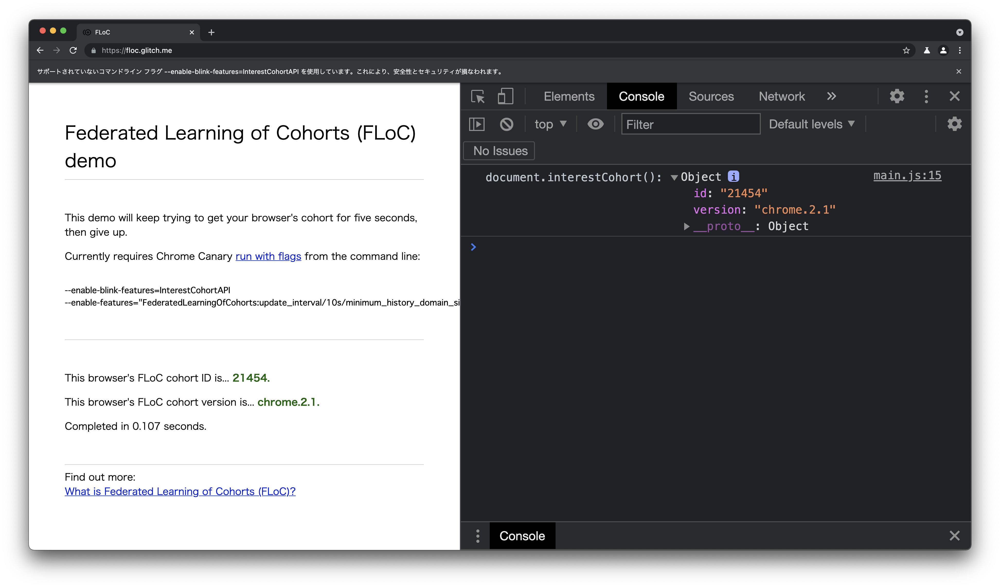

# FLoC Simulator

Command line FLoC simulator to calculate CohortID with using host list and cluster data. 

## Build and Run Demo
```
$ cd

$ cd demos/floc_sample/
ohtsu@opro:~/github/shigeki/floc_simulator/demos/floc_sample$ go build
$ go get
go: downloading golang.org/x/net v0.0.0-20210405180319-a5a99cb37ef4
$ go build
$ ./floc_sample host_list.json
domain_list: [nikkei.com hatenablog.com nikkansports.com yahoo.co.jp sponichi.co.jp cnn.co.jp floc.glitch.me ohtsu.org]
sim_hash: 779363756518407
cohortId: 21454
```
Input json file of host list for history data is needed to run. See [host_list.json](./host_list.json) file in this repo.

Comuputed result below shows the same cohort Id as Chromium that has the history of servers included in host_list.json.
This is only tested in the FLoC version of "Chrome 2.1".


## Notes on a domain list when you compare the cohort ID between Chrome and floc_simulator
Chrome requires the following requirements for the domain list in your browsing histories.
Please be sure if your domain list for this simulator meets them when you compare the result of cohort Id between Chrome and floc_simulator.
You need to use the exact same domain list as that used in Chrome.

```
// computation. The history entry is eligible for floc computation if all of the
// following conditions hold:
// 1) the IP of the navigation was publicly routable.
// 2) the interest-cohort permissions policy in the main document allows the
// floc history inclusion.
// 3) either the page has an ad resource, or the document.interestCohort API is
// used in the page.
```

## References
- [Federated Learning of Cohorts (FLoC)](https://github.com/WICG/floc)
- [What is Federated Learning of Cohorts (FLoC)?](https://web.dev/floc/)
- [FLoC Origin Trial & Clustering](https://www.chromium.org/Home/chromium-privacy/privacy-sandbox/floc)
- [Evaluation of Cohort Algorithms for the FLoC API](https://github.com/google/ads-privacy/tree/master/proposals/FLoC)
- [Measuring Sensitivity of Cohorts Generated by the FLoC API](https://docs.google.com/viewer?a=v&pid=sites&srcid=Y2hyb21pdW0ub3JnfGRldnxneDo1Mzg4MjYzOWI2MzU2NDgw)
- [Federated Learning Component](https://chromium.googlesource.com/chromium/src/+/refs/heads/main/components/federated_learning/)


